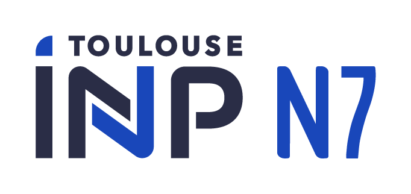

 
 

# Semester 7-2A-SN-ENSEEIHT

### 考试占比
|UE|科目|占比|考核形式|是否结束|
|:----:|:----:|:----:|:----:|:----:|
|UE - Systèmes Concurrents et Communicants|Systèmes Concurrents |50%|Examen|<ul><li>- [x] </li></ul>|
|-|Intergiciels|30%|Examen|<ul><li>- [x] </li></ul>|
|-|Projet - Données Réparties|20%|Projet|<ul><li>- [x] </li></ul>|
|UE - Théorie des Automates et des Langages, Théorie des Graphes|Automates|35%|Examen|<ul><li>- [x] </li></ul>|
|-|BE - Automates|15%|BE (Binômes)|<ul><li>- [x] </li></ul>|
|-|Théorie des Graphes|35%|Examen|<ul><li>- [x] </li></ul>|
|-|Projet - Théorie des Graphes|15%|Projet (Individual)|<ul><li>- [x] </li></ul>|
|UE - Programmation Fonction|BE - Programmation Fonction|20%|BE (Individual)|<ul><li>- [x] </li></ul>|
|-|Programmation Fonction Avancée|40%|Examen|<ul><li>- [x] </li></ul>|
|-|Projet - Programmation Fonction|40%|Projet (Binômes)|<ul><li>- [x] </li></ul>|
|UE - Génie du Logiciel et des Systèmes|Ingénierie dirigée par les modèles & Métaprogrammation et tests|40%|Examen|<ul><li>- [x] </li></ul>|
|-|MiniProjet - IDM|30%|Mini-Projet (Binômes)|<ul><li>- [x] </li></ul>|
|-|Projet - IDM|30%|Projet (Quadrinômes)|<ul><li>- [x] </li></ul>|
|UE - Optimisation et Recherche Opérationnelle|Optimisation Numérique|25%|Examen|<ul><li>- [x] </li></ul>|
|-|Projet - Optimisation Numérique|25%|Projet (Individual)|<ul><li>- [x] </li></ul>|
|-|Recherche Opérationnelle|25%|Examen|<ul><li>- [x] </li></ul>|
|-|TP - Recherche Opérationnelle|25%|TPs (Binômes)|<ul><li>- [x] </li></ul>|

### INTRODUCTION
这个仓库里的内容均为[*Département Sciences du Numérique - E.N.S.E.E.I.H.T.* 2021~2022学年-第1学期](http://formations.enseeiht.fr/fr/offre-de-formations/diplome-d-ingenieur-FC_DI/diplome-D/ingenieur-enseeiht-informatique-et-telecommunications-program-n7i5-171/ingenieur-enseeiht-informatique-et-telecommunications-2eme-annee-subprogram-n7i52-181.html)的教学资料，其中包括所有科目的**Cours**、**TD**、**TP**、**Projet**以及**Examen**的Sujet、Slide、Source Code以及我个人的Rapport和部分笔记。希望能对你有所帮助。

### IMPORTANT: 

本仓库的所有内容仅可用于学习交流，请勿用于任何商业用途。所有Cours、TD、TP、Projet以及Examen的Sujet和Slide版权属于`©E.N.S.E.E.I.H.T.`，侵权必究。
  * CH：如果你是ENSEEIHT的学生，请`不要直接复制任何项目到你自己的作业中`.由于学校有查重系统，你的每一次作业都会与同期和往届的学生比对，一旦认定为抄袭，按0分处理。
  * EN：If you are a student of ENSEEIHT, please `Do not copy anything directly into your own homework`. Otherwise, you will be considered `CHEATING`, and you will be dealt with with a score of 0.
  * FR: Si vous êtes étudiant à l'ENSEEIHT, merci de `Ne rien copier directement dans vos devoirs`. Sinon, vous serez considéré comme *« TRICHE »* et vous ne validez pas le cours.
