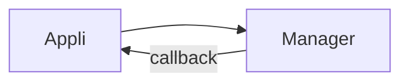
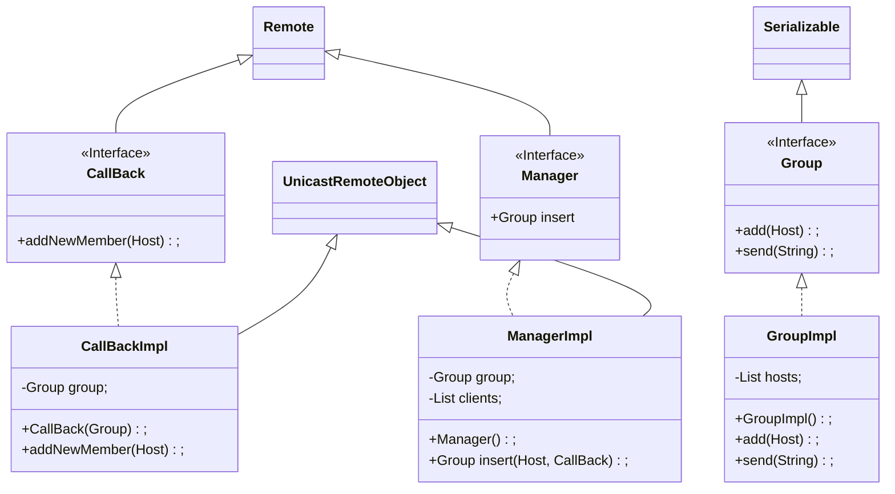
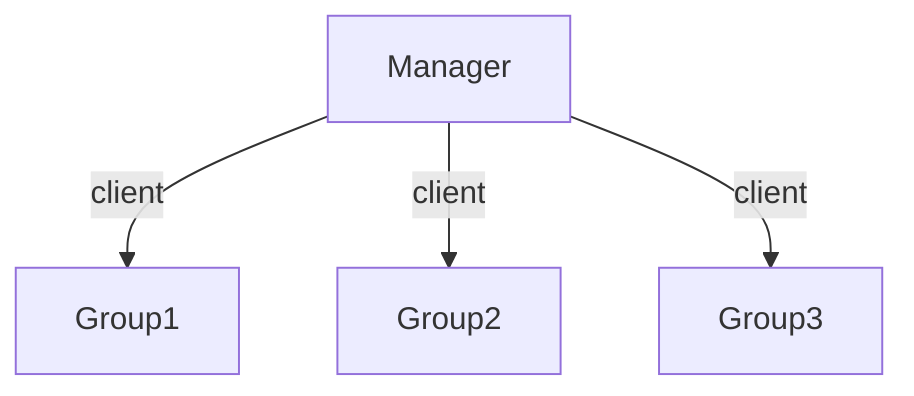

### Tutorat : Intergiciel

#### Problem Socket and RMI

`Serializable`: On envoie une copie de l'objet les modification restent locales

`Remote` : On envoie une "reference".Les modification ...






```java
public interface Manager extend Remote{
  public Group insert(Host h, CallBack cb) throws RemoteException;
}
```

```java
public interface Group extends Serializable{
  void add(Host h);
  void send(String msg);
}
```

```java
public interface CallBack extend Remote{
  pubilc void addNewMember (Host h) throws RemoteException;
}
```

```java
public class GroupImpl implements Group{
  private List <Host> hosts;
  
  public GroupImpl () {
    this.hosts = new ArrayList<>();
  }
  
  public void add (Host h){
    this.host.add(h);
  }
  
  public void send (String message) {
    for (Host: hosts) {
      Socket s = new Socket (h.host,h.port);
      OutputStream outputStream = s.getOutputStream();
      outputStream.write(message);
    }
  }
}
```

```java
public class CallBackImpl extend UnicastRemoteObject implements Callback {
  private Group group;
  public CallBack (Group g) throws RemoteExeception {
    this.group = g;
  }
  
  public void addNewMember (Host h) throws RemoteException {
    this.group.add(h);
  }
  
}
```

```java
public class ManagerImpl extend UnicastRemoteObject implements Manager {
  private Group group;
  private List<CallBack> clients;
  
  public Manager () throw RemoteException {
    this.group = new Group();
    this.clients = new ArrayList<>();
  }
  
  public Group insert(Host h, CallBack cb) throw RemoteException {
    for (CallBack cb:clients) {
      cb.addNewMenber(h);
    }
    client.add(cb);
    this.group.add(h);
    return this.group;
  }
}
```



```java
public final static URL = "://127.0.0.1:4000/Manager";
public static void main(String[] args) {
  Registry rmi = LocateRegistry.creatRegistry(4000);
  Manager m = new Manager();
  Naming.bind(URL, m);
}
```

```java
public class Application {
  private Group group;
  public static void main (String[] args) {
    if (args.length != 2){
      exit(0);
    } else {
      new Thread() {
        @override
        public void run(){
          ServerSocket socketserver = new ServerSocket(this.port);
          while (true){
            Socket client = socketserver.accept();
            InputStream inputStream = client.grtInputStream();
            byte[] buffer = new byte[1024];
            inputStream.read(buffer);
            System.out.println(buffer);
          }
        }.start();
        
        Manager manager = (Manager) Naming.lookup(ManagerImpl, URL);
        Group group = new Group();
        group = m.insert(new Host(args[0], args[1]), new CallBackImpl(group)); // 0:msg 1:port
        group.send("Hello!");
      }
    }
  }
}
```


WS WOAP: REST is a set of architectural principles attuned to the needs of lightweight [web services](https://www.redhat.com/en/topics/cloud-computing/what-are-cloud-services) and [mobile applications](https://www.redhat.com/en/topics/mobile).

WS REST: SOAP is a standard protocol that was first designed so that applications built with different languages and on different platforms could communicate. 


