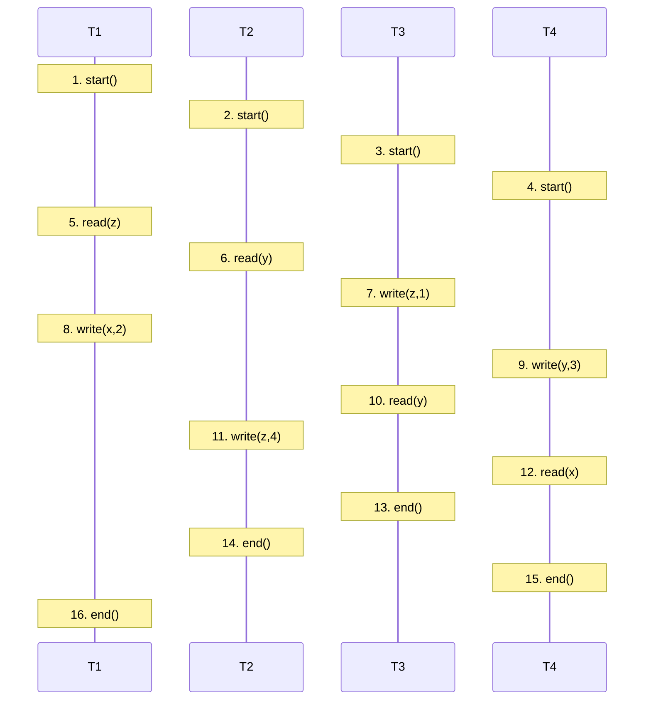
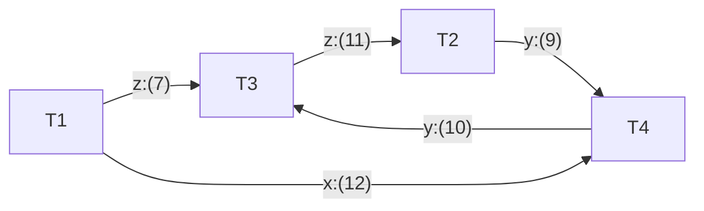
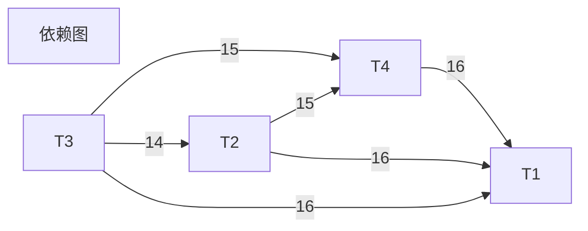

## Tutorat : concurrent systeme

##### Question

- transaction 中的读写冲突， ACID 属性，事务的【依赖图】
- concurrent control 

```
n := y +1;
t1.write(t1.read(y));
```

- 多进程的内存共享，并发，互斥

#####  Exercise 1. Concurrent  execution

```java
demande[i] = true;			// 1
while (tour != i) {			// 2
    while (demand[j]) {			// 3
        wait();				// 4
    }					// 5
    tour <- i;				// 6
}					// 7
/** SECTION CRITIQUE */			// 8
demande[i] = false;			// 9
```

1. 描述：算法并不会确保互斥地访问临界区。

   ```mermaid
   sequenceDiagram
       participant T1
       participant T2
       
       Note over T1 :(1) demande[1]=true
       Note over T1 :(2) tour=2
       Note over T1 :(3) demande[2]=false
       
       T1 --> T2 : 此时, T2进程开始请求临界区
       
       Note over T2 :(1) demande[2]=true
       Note over T2 :(2) tour=2
       Note over T2 :(7)
       
       Note over T1 :(6) tour <- 1
       Note over T1 :(2) tour=1
       Note over T1 :(7)
       
       T1 --> T2 : 此时, T1和T2进程可以同时访问临界区
       Note over T2 :(8) SECTION CRITIQUE
       Note over T1 :(8) SECTION CRITIQUE
   ```

   

2. 描述：算法会导致饥饿

   ```mermaid
   sequenceDiagram
       participant T1
       participant T2
       
       Note over T1 :(1) demande[1]=true
       Note over T2 :(1) demande[2]=true
       
       Note over T1,T2 :(2) tour=2
       
       Note over T1 :(3) demande[2]=true
       Note over T1 :(4) wait()
       
       Note over T2 :(7)
       Note over T2 :(8) SECTION CRITIQUE
       Note over T2 :(9) demande[2]=false
       
       Note over T2 :(1) demande[2]=true
       Note over T2 :... ❓
       
       Note over T1 :(4) wait()
      
   ```
   
   
   
   

##### Exercise 2. 

同步问题：

|            | marins | personnals |
| :--------: | :----: | :--------: |
|     N      |   4    |     2      |
|     V      |   3    |     3      |
| disponible |   3    |     3      |
|            |   0    |     1      |


```java
Semphore PE[category] = new Semphore [0,0];
mutex := 1 // 互斥信号量
```

```java
lever_l_ancre (t){ // reviel de NB[t,M] marin et NB[t,P]
	for(int i = 1; i < (NB[t,M] + NB[t,P]); i++){
		monter.down();
	}
}
```

```java
embarquer (c) {
  PE(c).down(); // marin可以登船的信号量
  monter.up(); //
}
```

```java
appeler_equipage (t) {
  mutex.down();
  if (dispo[-] >= NB[t] ){
    for(int i = 1; i < (NB[t,M]; i++){
      PE.[M].up();
    }
  } else {
    mutex.up(); // why?
    PLA[t].down(); // Peur_Lancer_lAncre
  }
}
```

```java
se_presenter(c) {
  mutex.up();
  dispo[c]++;
  if (dispo[-] >= NB[t]){
    PLA[+].down();
  }
}
```


##### Exercise 3. Transaction







