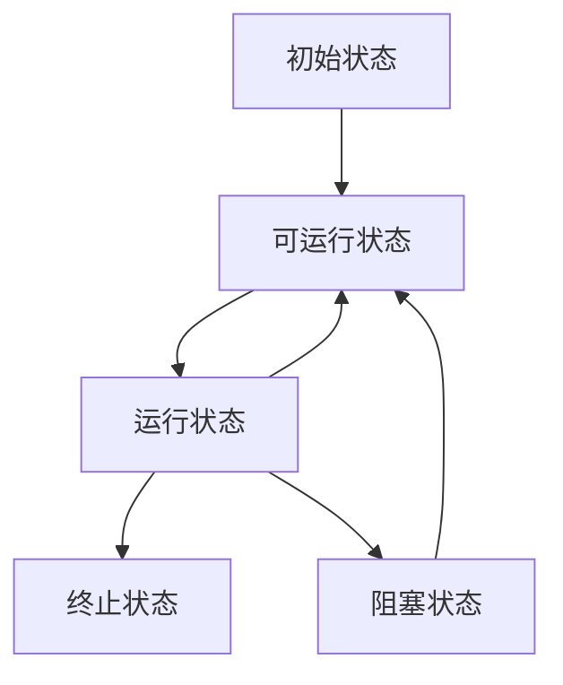

# Java的并发编程：线程的相关概念
- 视频教程：[BiliBili-黑马程序员全面深入学习Java并发编程，JUC并发编程全套教程](https://www.bilibili.com/video/BV16J411h7Rd)
- 笔记（Markdown）：[Gitee](https://gitee.com/gu_chun_bo/java-construct/blob/master/java%E5%B9%B6%E5%8F%91%E7%BC%96%E7%A8%8B/java%E5%B9%B6%E5%8F%911.md)
### 进程与线程
- 进程：当一个程序被运行，从磁盘加载这个程序的代码至内存，这时就开始了一个进程。进程可视为程序的一个实例。进程间相互独立
- 线程：一个进程可分为一到多个线程。一个线程是一个指令流，将指令流中的一条条指令以一定的顺序交给cpu执行。线程存在于进程中
- 线程为最小调度单位，进程为资源分配的最小单位。

### 并行与并发
- 并发：**单核cpu**下，线程是**串行执行**的，由于cpu在线程间的切换时间很快（时间片很短），人为感觉是同时运行的。**”微观串行，宏观并行”**。我们一般将这种**线程轮流使用cpu**的做法成为并发，concurrent。
- 并行：在**多核cpu**系统下可并行，parallel
通常既有并发，也有并行

### 同步与异步
从方法调用的角度来讲，如果
- 需要等待结果的返回，才能继续运行就是**同步**
- 不需要等待结果的返回，就能继续运行就是**异步**。对于长时间的文件调用，异步调用更好。


## Java线程
### 创建线程
1. 直接使用 new Thread()。
    ```java
    Thread t = new Thread () {
        public void run () {
            // 要执行的任务
        }
    }
    // 启动线程
    t.start();
    ```
2. 使用 Runnable 配合 Thread。
   ```java
    Runnable task1 = new Runnable () {
        public void run () {
            // 要执行的任务
        }
    }
    Thread t = new Thread (task1);
    // 启动线程
    t.start();
    ```
    可以用lambda简化代码，类似函数式编程

- 方法1是将线程和任务放在一起，方法2是把线程和任务分开了
- 用 Runnable 更容易与线程池等高级API结合，更灵活。

## 线程运行原理
### 线程上下文切换（Thread Context Switch）
因为以下一些原因导致cpu不再运行当前线程，转而执行另一个线程的代码：
- 线程的cpu时间片用完
- 垃圾回收
- 有更高优先级的线程需要运行
- 线程自己调用了sleep，yield，wait，join，park，synchrnized，lock 等方法  
当上下文切换发生时，需保存当前线程的状态，并恢复另一个线程的状态。频繁切换会影响性能。
    - sleep（当前线程休眠）: 调用sleep（）会让当前线程从*Running*状态进入*Timed Waiting*阻塞状态，该方法不占用cpu。
    - yield（当前线程让出cpu使用权）: 调用yield（）会让当前线程从*Running*状态进入*Runnable*就绪状态
    - join（同步等待）: 等待调用线程运行结束
    - interrupt（打断）

## 两阶段终止模式（Two Phase Termination）
```java
/*  两阶段终止模式（Two Phase Termination）：在进程T1中终止进程T2
    在终止进程T2之前让T2释放锁和临界资源
    不用stop（） 和 System.exit（）
*/
class TwoPhaseTermination {
    // 监控线程
    privite Thread monitor;

    // 启动监控线程
    public void start() {
        monitor = new Thread (() -> {
            while (true) {
                Thread current = Thread.currentThread();
                if (current.isInterrupted()) {
                    // TODO 释放锁和临界资源
                    System.out.println("释放锁和临界资源");
                    break;
                }
                try {
                    Thread.sleep(1000); // 情况1
                    /*
                        TODO 正常功能的代码块
                    */
                    // 情况2
                } catch (InterruptedException e) {
                    e.printStackTrace();
                    // 若sleep时被打断，会捕获错误e，此时的isInterrupted标记为false，程序会重复执行。所以有以下操作
                    current.interrupt(); // 重新设置isInterrupted打断标记
                }
            }
        });
        monitor.start();
    }

    // 停止监控线程
    public void stop() {
        monitor.interrupt();
    }
}
```

### 主线程和守护线程
守护线程：只要其他**非守护线程运行结束了**，即使守护线程的代码没有执行完，也会强制结束
```java
Thread.setDeamon(true); // 默认false
```
## 线程的状态
### 五种状态（操作系统层面）
1. 初始状态：在**语言层面创建了线程对象**，但未与操作系统线程关联
2. 可运行状态：（就需状态），已与操作系统线程关联，可由cpu调度执行
3. 运行状态：获得cpu时间片，正在执行。
   - 当cpu时间片用完，由【运行状态】转为【可运行状态】，导致线程的上下文切换
4. 阻塞状态：该状态下的线程不会占用cpu，会导致线程的上下文切换
   - 等阻塞操作结束，系统唤醒阻塞状态，切换至【可运行状态】
5. 终止状态

### 六种状态（Java语言 API层面）
1. NEW：线程被创建，还没有调用strat（）方法
2. RUNNABLE：调用了start（）方法后。该状态涵盖了**操作系统层面**的*【可运行状态】、【运行状态】和【阻塞状态】*
3. 三种“java中的阻塞状态”：
   1. BLOCKED：
   2. WAITING：
   3. TIMED_WAITING：
4. TERMINATED：代码运行结束
```java
Thread t1 = new Thread("t1") {
    public void run () {}
};
t1.getState(); // NEW


Thread t2 = new Thread("t2") {
    public void run () {
        while (true){ // 运行中: RUNNABLE

        }
    }
};
t2.getState(); // RUNNABLE


Thread t3 = new Thread("t3") {
    public void run () {
        System.out.println("t3: Termination");
    }
};
t3.start();
t3.getState(); // TERMINATED


Thread t4 = new Thread("t4") {
    public void run () {
        synchronized (example.class) {
            try {
                Thread.sleep(300000); // TIMED_WAITING
            } catch (InterruptedException e) {
                    e.printStackTrace();
                    
            }
        }
    }
};
t4.getState(); // TIMED_WAITING


Thread t5 = new Thread("t5") {
    public void run () {
        try {
                t2.join() // WAITING
            } catch (InterruptedException e) {
                    e.printStackTrace();
                    
            }
    }
};
t5.getState(); // WAITING


Thread t6 = new Thread("t6") {
    public void run () {
    /*
        由于t2对example这个类上锁，所以t6并不能完成该上锁操作
        状态：BLOCKED阻塞状态
    */
        synchronized (example.class) {
            try {
                Thread.sleep(300000); // TIMED_WAITING
            } catch (InterruptedException e) {
                    e.printStackTrace();
                    
            }
        }
    }
};
t6.getState(); // BLOCKED
```
# 进程互斥
进程互斥指当一个进程访问某临界资源时，另一个想要访问该临界资源的进程必须等待。当前访问临界资源的进程结束，释放临界资源之后，另一个进程才能去访问临界资源。

临界区资源的互斥访问，可以逻辑上分为：
```java
do {
    entry section; // 进入区：负责检查是否可进入临界区，若可以，应设置*正在访问临界资源的标志*，即上锁
    critical section; // 临界区：访问临界资源的那段代码
    exit section; // 退出区：负责解除正在访问临界资源的标志
    remainder section; //剩余区：做其他处理
} while (true)
// 进入区和退出区是负责*实现互斥*的代码段
```

需要遵守以下**原则**
1. 空闲让进。临界区空闲时，可以允许一个请求进入临界区的进程立即进入临界区；
2. 忙则等待。当已有进程进入临界区时，其他试图进入临界区的进程必须等待；
3. 有限等待。对请求访问的进程，应保证能在有限时间内进入临界区（保证不会饥饿）
4. 让权等待。当进程不能进入临界区时，应立即释放处理机，防止进程忙等待。

## 进程互斥的软件实现方法
### 单标志法 Alternance
算法思想：两个进程在**访问完**临界区后会把使用临界区的权限**转交**给另一个进程。也就是说**每个进程进入临界区的权限只能被另一个进程赋予**。交替进入临界区。
```java
int turn = 0;
// 进程0
while (turn != 0){ // 进入区
    nop();
}
    critical section;// 临界区
    turn = 1; // 退出区
    remainder section; //剩余区

// 进程1
while (turn != 1){ // 进入区
    nop();
}
    critical section;// 临界区
    turn = 0; // 退出区
    remainder section; //剩余区
```
主要问题：违背“空闲让进”原则，必须“轮流访问”

### 双标志后检查法 Priorite a l'autre demandeur
先设置标志，表示自己想进入，检查对方标志，如果对方也要进入，那么就等待否则就进入

```java
boolean flag[2]; // 表示进入临界区意愿的数组
flag[0] = false;
flag[1] = false;
// 进程0
    flag[0] = true; // 想进入临界区
    while (flag[1]){ // 如果另一个进程也想进入临界区，则该进程等待
        nop；
    }
    critical section;// 临界区
    flag[0] = false; // 修改为不想使用临界区
    remainder section; //剩余区

// 进程1
    flag[1] = true; // 想进入临界区
    while (flag[0]){ // 如果另一个进程也想进入临界区，则该进程等待
        nop；
    }
    critical section;// 临界区
    flag[1] = false; // 修改为不想使用临界区
    remainder section; //剩余区
```
优点：不会两个进程都进入临界区

缺点：双方会互相谦让，导致饥饿

### Peterson 算法（不会饥饿）

算法思想：结合双标志法、单标志法的思想。如果双方都争着想进入临界区，那可以让进程尝试“孔融让梨”（谦让）。做一个有礼貌的进程。
- 增加标志位
```java
boolean flag[2]; // 表示进入临界区意愿的数组
flag[0] = false;
flag[1] = false;
int turn = 0; //表示优先让哪个进程进入临界区
// 进程0
    flag[0] = true; // 自己想进入临界区
    turn = 1; // 可以优先让对方进入临界区 **新增**
    while (flag[1] && turn = 1){ // 如果另一个进程也想进入临界区，则该进程等待
        nop；
    }
    critical section;// 临界区
    flag[0] = false; // 修改为不想使用临界区
    remainder section; //剩余区

// 进程1
    flag[1] = true; // 自己想进入临界区
    turn = 0; // 可以优先让对方进入临界区 **新增**
    while (flag[0] && turn = 0){ // 如果另一个进程也想进入临界区，则该进程等待
        nop；
    }
    critical section;// 临界区
    flag[1] = false; // 修改为不想使用临界区
    remainder section; //剩余区
```
- 优点：**不会饥饿**
- 缺点：较为复杂

## 进程互斥的硬件实现方法
### 中断屏蔽法 Interruptions
利用**开/关中断指令**实现（与原语的实现思想相同，即在某进程开始访问临界区到结束访问为止都不允许被中断，也就不能发生进程切换，因此也不可能发生两个同时访问临界区的情况）

- 优点：简单、高效
- 缺点：不适用于多处理机；只适用于操作系统内核进程，不适用于用户进程（因为开/关中断指令只能运行在`内核态`，这组指令如果能让用户随意使用会很危险）

### TestAndSet指令（TSL）
TSL 指令是用**硬件**实现的，执行的过程不允许被中断，只能一气呵成

相比软件实现方法，TSL 指令把“上锁”和“检查”操作用硬件的方式变成了一气呵成的原子操作。

- 优点：实现简单，无需像软件实现方法那样严格检查是否会有逻辑漏洞；适用于**多处理机环境**
- 缺点：**不满足“让权等待”原则**，暂时无法进入临界区的进程会占用CPU并循环执行TSL指令，从 而导致“忙等”。

### Swap指令（XCHG）
逻辑上来看 Swap 和 TSL 并无太大区别，都是先记录下此时临界区是否已经被上锁（记录在 old 变 量上），再将上锁标记 lock 设置为 true，最后检查 old，如果 old 为 false 则说明之前没有别的进程 对临界区上锁，则可跳出循环，进入临界区。

- 优点：实现简单，无需像软件实现方法那样严格检查是否会有逻辑漏洞；适用于多处理机环境
- 缺点：不满足“让权等待”原则，暂时无法进入临界区的进程会占用CPU并循环执行TSL指令，从 而导致“忙等”。

## 信号量 Semaphore
用户进程可以通过使用操作系统提供的**一对原语**来对**信号量**进行操作，从而很方便的实现进程互斥和同步。
- 信号量其实就是一个变量`S`，用以**表示系统中某种资源的数量**。
- 原语是一种特殊的程序段，**执行的过程不允许被中断**，只能一气呵成。
- 一对原语：
  - `P(S)` = wait(S) = down(S) = acquire(S) = `S = S - 1`
  - `V(S)` = signal(S) = up(S) = release(S) = `S = S + 1`

### 用信号量机制实现进程互斥
1. 分析并发进程的关键活动（activity），划定临界区
2. 设置**互斥信号量mutex**，初值为`1`。不同的临界资源需要设定不同的互斥信号量。
3. 在临界区之前执行P（mutex）
4. 在临界区之后执行V（mutex），P（）和V（）操作必须成对出现
```java
/* 信号量机制实现进程互斥 */
Semaphore mutex = new Semaphore(1); // 初始化信号量

P1(){
    // ...
    mutex.wait(); // 加锁
    critical section; // 临界区
    mutex.signal(); // 解锁
    // ...
}

P2(){
    // ...
    mutex.wait(); // 加锁
    critical section; // 临界区
    mutex.signal(); // 解锁
    // ...
}
```

### 用信号量机制实现进程同步
1. 分析什么地方需要实现“同步关系”，即必须保证“一前一后”执行的两个操作
2. 设置**同步信号量S**，初值为`0`。
3. 在“前面的操作”之后执行V（S）
4. 在“后面的操作”之前执行P（S）

`事例见下文生产者/消费者问题`

### 生产者/消费者问题
**问题分析：**

系统中有一组**生产者进程**和**一组消费者进程**，生产者进程每次生产一个产品放入缓冲区，消费者进程每次从缓冲区中取出一个产品并使用。（注：这里的“产品”理解为某种数据）
- 生产者、消费者共享一个**初始为空、大小为n的缓冲区**，
- 只有**缓冲区没满**时，生产者才能把产品放入缓冲区，否则必须等待。
- 只有**缓冲区不空时**，消费者才能从中取出产品，否则必须等待.
缓冲区是临界资源，各进程必须**互斥地访问**。

**分析步骤：**

1. 关系分析。找出题目中描述的各个进程，分析它们之间的**同步、互斥**关系。
2. 整理思路。根据各进程的操作流程确定P、V操作的大致顺序
3. 设置信号量。设置需要的信号量，并根据题目条件确定信号量初值。（互斥信号量初值一般为1，同步信号量的初始值要看对应资源的初始值是多少）

```java
Semaphore mutex = new Semaphore(1); // 初始化互斥信号量，表示对缓冲区的互斥访问
Semaphore tempon_empty = new Semaphore(N); // 同步信号量，表示空闲缓冲区的数量
Semaphore tempon_full = new Semaphore(0); // 同步信号量，表示产品数量，即非空缓冲区的数量
```
```java
Producer() {
    while(true) {
        生产一个产品; // 第1步
        tempon_empty.down(); // 第2步，预将产品放入缓冲区，空闲缓冲区数量-1

        mutex.down();       /*************/
        将产品放入缓冲区;      /* 互斥操作临界区 */
        mutex.up();         /*************/

        tempon_full.up(); // 第3步，已将产品放入缓冲区，产品数量+1
    }
}
```
```java
Comsumer() {
    while(true) {
        tempon_empty.up(); // 第1步，预将产品从缓冲区中取出，空闲缓冲区数量+1

        mutex.down();           /*************/
        从缓冲区取出一个产品;      /* 互斥操作临界区 */
        mutex.up();             /*************/

        tempon_full.down(); // 第2步，已将产品取出，欲使用产品，产品数量-1
        使用产品;
    }
}
```
### 读者-写者问题
**问题分析：**
有**读者**和**写者**两组并发进程**共享一个文件**，当`两个或两个以上的读进程同时访问共享数据时不会产生副作用`，但若某个写进程和其他进程(读进程或写进程）同时访问共享数据时则可能导致数据不一致的错误。因此要求：
```
1. 允许多个读者可以同时对文件执行读操作；
2. 只允许一个写者往文件中写信息；
3. 任一写者在完成写操作之前不允许其他读者或写者工作；
4. 写者执行写操作前，应让己有的读者和写者全部退出
```
**分析步骤：**

1. 关系分析。找出题目中描述的各个进程，分析它们之间的**同步、互斥**关系。
   - 两类进程：写进程，读进程
   - 互斥关系：写进程-写进程；写进程-读进程。两个读进程间不存在互斥问题。
     - 写进程和任何进程都互斥，所以设置一个互斥信号量rw，在写者访问共享文件前后分别执行P，V操作；
     - 写进程和读进程也互斥，所以读者访问共享文件前后也要对互斥信号量rw分别执行P，V操作；
     - 可以设计一个整数变量count来记录当前有几个读进程在访问文件。以实现当有两个读进程时，**第二个读进程不必再进行P（rw）操作，而直接访问文件**。
2. 整理思路。根据各进程的操作流程确定P、V操作的大致顺序
3. 设置信号量。设置需要的信号量，并根据题目条件确定信号量初值。（互斥信号量初值一般为1，同步信号量的初始值要看对应资源的初始值是多少）
```java
Semaphore rw = new Semaphore(1); // 初始化互斥信号量，表示当前是否有进程正在访问共享文件
int count = 0; // 记录当前有几个读进程在访问文件
Semaphore mutex = new Semaphore(1); // 互斥信号量，用以保证对count变量的互斥访问
Semaphore w = new Semaphore(1); // 互斥信号量，用于实现“写优先”（先到先服务）
```
该策略为**读者优先**：<br>**写进程**可能会一直阻塞等待，从而**饿死**
```java
Writer() {
    while(true){
        rw.down();      // 写之前“加锁”
        写文件；
        rw.up();        // 写之后“解锁”
    }
}
```
```java
Reader() {
    while(true){
/********************************************/
        mutex.down();       // 各个读进程互斥的访问count
        if (count == 0) {   // 因为对count的检查和赋值不是原子性的，所以要对count“上锁”
            rw.down();      // 对第一个读进程“加锁”
        }
        count ++;
        mutex.up();
/********************************************/
        读文件；
/********************************************/
        mutex.down();       // 各个读进程互斥的访问count
        count --;
        if (count == 0) {
            rw.up();        // 最后一个读进程负责“解锁”
        }
        mutex.up();
/********************************************/
    }
}
```

**写优先（先到先服务）：**
```
注意分析以下并发执行w.down()的情况：
1. 读者1 -> 读者2
2. 写者1 -> 写者2
3. 写者1 -> 读者1
4. 读者1 -> 写者1 -> 读者2
5. 写者1 -> 读者1 -> 写者2
```
```java
Writer() {
    while(true){
        w.down();       
        rw.down();      // 写之前“加锁”
        写文件；
        rw.up();        // 写之后“解锁”
        w.up();
    }
}
```
```java
Reader() {
    while(true){
/********************************************/
        w.down();
        mutex.down();       // 各个读进程互斥的访问count
        if (count == 0) {   // 因为对count的检查和赋值不是原子性的，所以要对count“上锁”
            rw.down();      // 对第一个读进程“加锁”
        }
        count ++;
        mutex.up();
        w.up();
/********************************************/
        读文件；
/********************************************/
        mutex.down();       // 各个读进程互斥的访问count
        count --;
        if (count == 0) {
            rw.up();        // 最后一个读进程负责“解锁”
        }
        mutex.up();
/********************************************/
    }
}
```
**核心思想：**
- 设置了一个**计数器count**用来记录当前正在访问共享文件的读进程数，从而根据进程是否是**第一个/最后一个**读进程，而做出不同的处理。
- 体会如何解决**写进程饥饿**的

### 哲学家问题
圆桌上坐着5名哲学家，每两个哲学家之问的桌上摆一根筷子，桌子的中间是一碗米饭。哲学们倾注毕生的精力用于思考和进餐，哲学家在思考时，并不影响他人。只有当哲学家饥饿时才试图拿起左、右两根筷子（一根一根地拿起）。如果筷子已在他人手上，则需等待。饥饿的哲学家只有同时拿起两根筷子才可以开始进餐。当进餐完毕后，放下筷子继续思考。

1. 关系分析。系统中有5个哲学家进程，5位哲学家**与左右邻居对其中间筷子的访问**是**互斥关系**
2. 整理思路。这个问题中只有互斥关系，但与之前遇到的问题不同的事，每个哲学家进程需要同时持有两个临界资源才能开始吃饭。如何**避免临界资源分配不当造成的死锁现象**，是哲学家问题的精髓。
3. 信号量设置。定义互斥信号量数组`chopstick [5] = {1,1,1,1,1}`用于实现对5个筷子的互斥访问。并对哲学家按`0~4`编号，哲学家`i`左边的筷子编号为`i`，右边的筷子编号为`(i+1) % 5`。
```java
Semaphore chopstick[5] = new Semaphore(1);
Semaphore mutex = new Semaphore(1);
```
```java
Philosoph_i () {    // i号哲学家进程
    while(true) {
        chopstick[i].down();            // 拿起左边筷子
        chopstick[(i+1)%5].down();      // 拿起右边筷子
        吃饭；
        chopstick[i].up();              // 放下左边筷子
        chopstick[(i+1)%5].up();        // 放下右边筷子
        思考；
    }
/*
    这种情况下，所有哲学家都会拿起左边的筷子，会造成死锁
*/
}
```
**注意：**这种情况下，所有哲学家都会拿起左边的筷子，会造成**死锁**。这种解决方案不合理。

**如何防止死锁的发生呢？**
1. 可以对哲学家进程施加一些限制条件，比如最多允许**四个哲学家同时进餐**。这样可以**保证至少有一个哲学家是可以拿到左右两只筷子**的
2. 要求**奇数号哲学家先拿左边的筷子，然后再拿右边的筷子**，而**偶数号哲学家刚好相反**。用这种方法可以保证如果相邻的两个奇偶号哲学家都想吃饭，那么只会有其中一个可以拿起第一只筷子，另一个会直接阻塞。这就避免了占有一支后再等待另一只的情况。
3. 当且仅当一个哲学家**左右两只筷子都可用时才允许他挂起筷子**。
```java
Semaphore chopstick[5] = new Semaphore(1);
Semaphore mutex = new Semaphore(1); // 互斥地取筷子
```
```java
/*
    实现方法3.
*/
Philosoph_i () {    // i号哲学家进程
    while(true) {
        mutex.down();                   // 拿两个筷子的锁
        chopstick[i].down();            // 拿起左边筷子
        chopstick[(i+1)%5].down();      // 拿起右边筷子
        mutex.up();
        吃饭；
        chopstick[i].up();              // 放下左边筷子
        chopstick[(i+1)%5].up();        // 放下右边筷子
        思考；
    }
}
```
**总结：**
- 这些**进程之间只存在互斥关系**，但是与之前接触到的互斥关系不同的是，每个进程都需要同时持有两个临界资源，因此就有“死锁”问题的隐患。
- 如果在考试中遇到了一个进程需要同时持有**多个临界资源的情况**，应该**参考哲学家问题的思想**，分析题中给出的进程之间**是否会发生循环等待，是否会发生死锁**。
- 可以参考哲学家就餐问题解决死锁的三种思路

### 死锁
在并发环境下，各进程因竞争资源而造成的一种**互相等待对方手里的资源，导致各进程都阻塞，都无法向前推进的现象**，就是死锁。  
每个人都占有一个资源，同时又在等待另一个人手里的资源。发生“死锁”。

### 饥饿
饥饿：由于**长期得不到想要的资源**，某进程无法向前推进的现象。  
比如在短进程优先 （SPF)算法中，若有源源不断的短进程到来，则长进程将一直得不到处理机，从而发生长进程“饥饿“

### 死循环
死循环：某进程执行过程中一直跳不出某个循环的现象。有时是因为程序逻辑bug 导致的，有时是程序员故意设计的。

# Java的并发编程：共享模型之管程
管程是一种高级同步机制，由于实现进程的互斥和同步。

管程是一种特殊的软件模块，有这些部分组成：
1. 局部于管程的共享数据结构说明;
2. 对该数据结构进行操作的一组过程;
3. 对局部于管程的共享数据设置初始值的语句;
4. 管程有一个名字。
- Tips: “过程〞 其实就是“函数”

管程的**基本特征**：
1. 局部于管程的数据只能被局部于管程的过程所访问;
2. 一个进程只有**通过调用管程内的过程**才能进入管程访问共享数据;
3. 每次**仅允许一个进程**在管程内执行某个内部过程。

### Java中类似于管程的机制
Java 中，如果用关键字`synchronized` 来描述一个函数，那么这个函数同一时间段内只能被一个线程调用
```java
static class monitor {
    private Item buffer[] = new Item[N]:
    private int count = 0;
    public synchronized void insert (Item item) {  // 每次只能有一个线程进入insert 函数，如果多个线程同时调用 insert 函数，则后来者需要排队等待
        ...
    }
}
```


我们考虑如下情形：
```java
static int count = 0;
    public static void main(String[] args) throws InterruptedException {
        Thread t1 = new Thread(()->{
            for (int i = 1;i<5000;i++){
                count++;
            }
        });
        Thread t2 =new Thread(()->{
            for (int i = 1;i<5000;i++){
                count--;
            }
        });
        t1.start();
        t2.start();
        t1.join();
        t2.join();
        System.out,println("count的值是",count);
    }
```
所得结果并不为`0`
### 临界区 Critical Section
一段代码块内如果存在对**共享资源**的多线程读写操作，称这段代码块为**临界区**
```java
static int counter = 0; // 共享资源
static void increment ()
// 临界区代码块
{
    counter ++;
}

static void decrement ()
// 临界区代码块
{
    counter --;
}
```
### 竞态条件 Race Condition
多个线程在临界区内执行，由于代码的**执行序列不同**而导致结果无法预测，称之为发生了**竞态条件**，多线程的安全问题  

- 阻塞式的解决办法：synchronized、锁
  - 锁又分为：互斥锁（mutex），自旋锁
- 非阻塞式的解决办法：原子变量

### 线程互斥锁：mutex
互斥锁可以确保一个资源**每次只被一个线程访问**
mutex = semaphore（1）
```java
    lock(); // 上锁
    // 访问临界区
    unlock(); //解锁
```

### Semaphore 信号量
信号量，用来限制能**访问共享资源的线程**上限。（类比于滑动窗口）
```java
public class testSemaphore {
    public static void main(String[] args) {
        // 1. 创建semaphore对象
        Semaphore semaphore = new Semaphore(3); // Semaphore(int,boolean), 其中int为访问共享资源的线程数、bool为是否公平

        // 2. 创建6个线程
        for (int i = 0; i < 6; i++) {
            new Thread (() -> {
                semaphore.acquire(); // 获得许可，semaphore数量减1
                System.out.println("Running...");
                Thread.sleep(1000);
                System.out.println("End...");
                semaphore.release(); // 释放许可，semaphore数量加1
            }).start();
        }
    }
}
/*
    运行结果为：
    Thread 0 : Running...
    Thread 1 : Running...
    Thread 2 : Running...
    (sleep 1s)
    Thread 0 : End...
    Thread 1 : End...
    Thread 2 : End...


    Thread 3 : Running...
    Thread 4 : Running...
    Thread 5 : Running...
    (sleep 1s)
    Thread 3 : End...
    Thread 4 : End...
    Thread 5 : End...
*/
```

## Synchronized解决方案
Synchronized，俗称【对象锁】。它采用互斥的方式让同一时刻至多只有一个线程持有【对象锁】，其他线程再想获得这个【对象锁】时就会阻塞住。这样就能保证拥有锁的线程可以安全的执行临界区内的代码块，不用担心上下文的切换。
`注意：`<br>虽然 java 中互斥和同步都可以采用 synchronized 关键字来完成，但它们还是有区别的：
- 互斥是保证临界区的竞态条件发生，同一时刻只能有一个线程执行临界区的代码
- 同步是由于线程执行的先后，顺序不同但是需要一个线程等待其它线程运行到某个点。
### Synchronized 语法：
```java
synchronized（对象，object）// 线程1获得锁， 那么线程2的状态是(blocked)
{
    临界区
}
```
```java
static int counter = 0;
static final Object lock = new Object();
public static void main(String[] args) throws InterruptedException {
     Thread t1 = new Thread(() -> {
         for (int i = 0; i < 5000; i++) {
             synchronized (lock) { // 加对象锁
             counter++;
        	}
 		}
 	}, "t1");
     Thread t2 = new Thread(() -> {
         for (int i = 0; i < 5000; i++) {
             synchronized (lock) { // 加对象锁
             counter--;
         }
     }
     }, "t2");
     t1.start();
     t2.start();
     t1.join();
     t2.join();
     System.out.println(counter);
}
```
此时的结果才为`0`。

### Synchronized 原理
synchronized实际上利用**对象锁**保证了临界区代码的**原子性**，临界区内的代码在外界看来是**不可分割**的，不会被线程切换所打断。
**建议锁的对象设置为`final`，这样就不可变了。**

### Synchronized 面向对象的改进
```java
lockObject lock = new lockObject();
public static void main(String[] args) throws InterruptedException {
     Thread t1 = new Thread(() -> {
         for (int i = 0; i < 5000; i++) {
            lock.increment();
        	}
 		}
 	}, "t1");
     Thread t2 = new Thread(() -> {
         for (int i = 0; i < 5000; i++) {
            lock.decrement();
         }
     }, "t2");
     t1.start();
     t2.start();
     t1.join();
     t2.join();
     System.out.println(counter);
}

class lockObject {
    private int counter = 0;
    //加操作
    public void increment() {
        synchronized (this) {
            counter++;
        }
    }
    //减操作
    public void decrement() {
        synchronized (this) {
            counter--;
        }
    }
    // 获取当前counter
    public int getCounter() {
        synchronized (this) {
            return counter;
        }
    }
}
```
### Synchronized 在方法上
```java
// 在成员方法上
class Test{
        public synchronized void test() {

        }
    }
//等价于
class Test{
    public void test() {
        synchronized(this) { // 锁住this对象
        }
    }
}
```
```java
// 在静态方法上
class Test{
        public synchronized static void test() {

        }
    }
//等价于
class Test{
    public static void test() {
        synchronized(Test.class) {
        }
    }
}
```
## 变量的线程安全分析
### 成员变量和静态变量的线程安全分析
- 如果没有变量没有在线程间共享，那么变量是安全的
- 如果变量在线程间共享
  - 如果只有读操作，则线程安全
  - 如果有读写操作，则这段代码是临界区，需要考虑线程安全
  
### 局部变量线程安全分析
- 局部变量【局部变量被初始化为基本数据类型】是安全的
- 局部变量引用的对象未必是安全的
  - 如果局部变量引用的对象没有引用线程共享的对象，那么是线程安全的
  - 如果局部变量引用的对象引用了一个线程共享的对象，那么要考虑线程安全的
  
### 常见线程安全类
- String
- Integer
- StringBuffer
- Random
- Vector
- Hashtable
- java.util.concurrent 包下的类
这里说它们是线程安全的是指，多个线程调用它们同一个实例的某个方法时，是线程安全的。也可以理解为它们的每个方法是原子的
```java
Hashtable table = new Hashtable();
new Thread(()->{
 	table.put("key", "value1"); 
}).start();
new Thread(()->{
 	table.put("key", "value2");
}).start();
```
### 习题
找出临界区代码，加锁
- 买票：BiliBili-黑马程序员全面深入学习Java并发编程，JUC并发编程全套教程 [买票问题](https://www.bilibili.com/video/BV16J411h7Rd?p=71)
- 转账：BiliBili-黑马程序员全面深入学习Java并发编程，JUC并发编程全套教程 [转账问题](https://www.bilibili.com/video/BV16J411h7Rd?p=74)

## Monitor 概念

## Wait/Notify
### API介绍
- `obj.wait()` 让进入obj监视器的线程到waitSet**等待**
- `obj.wait(long timeout)` 让进入obj监视器的线程到waitSet**等待 timeout时间长度**，继续执行
- `obj.notify()` 在obj上正在waitSet等待的线程中**随机选一个唤醒**
- `obj.notifyAll()` 让obj上正在waitSet等待的线程**全部唤醒** <br>
前提是：**必须获得此对象的锁**，才能调用这几个方法
```java
static final Object lock = new Object ();
public static void main(){

    new Thread (() -> {
        synchronized (lock) {
            try {
                lock.wait(); // 让线程t1在lock上一直等待下去
            } catch (InterruptedException e) {
                e.printStackTrace();
            }
        }
    },"t1").start();

    new Thread (() -> {
        synchronized (lock) {
            try {
                lock.wait(); // 让线程t2在lock上一直等待下去
            } catch (InterruptedException e) {
                e.printStackTrace();
            }
        }
    },"t2").start();

    Thread.sleep(2000);
    synchronized (lock) { // 主线程
        lock.notify(); // 随机唤醒一个
        lock.notifyAll(); // 唤醒所有
    }
}
```
### wait和sleep的区别
- sleep是Thread方法，wait是所有对象的方法
- sleep不用与synchronized一起用，wait需要与synchronized一起用
- sleep**不会释放锁**，wait在等待时**会释放锁**
相同点：进入的状态都是TIMED-WAITING
```java
synchronized (lock){
   while (条件不成立) {
       lock.wait();
    } 
    // TODO
}

// 另一个线程
synchronized (lock){
    lock.notify();
}
```
例子：
```java
import lombok.extern.slf4j.Slf4j;

import static cn.itcast.n2.util.Sleeper.sleep;

@Slf4j(topic = "c.TestCorrectPosture")
public class TestCorrectPostureStep4 {
    static final Object room = new Object();
    static boolean hasCigarette = false;
    static boolean hasTakeout = false;

    public static void main(String[] args) {


        new Thread(() -> {
            synchronized (room) {
                log.debug("有烟没？[{}]", hasCigarette);
                while (!hasCigarette) {
                    log.debug("没烟，先歇会！");
                    try {
                        room.wait();
                    } catch (InterruptedException e) {
                        e.printStackTrace();
                    }
                }
                log.debug("有烟没？[{}]", hasCigarette);
                if (hasCigarette) {
                    log.debug("可以开始干活了");
                } else {
                    log.debug("没干成活...");
                }
            }
        }, "小南").start();

        new Thread(() -> {
            synchronized (room) {
                Thread thread = Thread.currentThread();
                log.debug("外卖送到没？[{}]", hasTakeout);
                if (!hasTakeout) {
                    log.debug("没外卖，先歇会！");
                    try {
                        room.wait();
                    } catch (InterruptedException e) {
                        e.printStackTrace();
                    }
                }
                log.debug("外卖送到没？[{}]", hasTakeout);
                if (hasTakeout) {
                    log.debug("可以开始干活了");
                } else {
                    log.debug("没干成活...");
                }
            }
        }, "小女").start();

        sleep(1);
        new Thread(() -> {
            synchronized (room) {
                hasTakeout = true;
                log.debug("外卖到了噢！");
                room.notifyAll();
            }
        }, "送外卖的").start();
    }
}
```


# Java的并发工具：线程池 Thread Pool
### 自定义线程池
创建一批线程，让这些线程可以得到重复的利用。这样既可以减少内存的占用，也可以减少线程的数量，避免频繁的上下文切换。
```java
public class TestPool {

}
class BlockingQueue<T> {
    // 1.任务队列
    private Deque<T> queue = new ArrayDeque<>();
    // 2.锁
    private ReentrantLock lock = new ReentrantLock();
    // 3.生产者条件变量
    private Condition fullWaitSet = lock.newCondition();
    // 4.消费者条件变量
    private Condition emptyWaitSet = lock.newCondition();
    // 5.容量
    private int capcity;

    // 6.阻塞获取
    public T take() {
        lock.lock();
        try {
            while (queue.isEmpty()) {
                try emptyWaitSet.await();
            } catch (InterruptedException e) {
                e.printStackTrace();
            }
            T t = queue.removeFrist();
        } finally {
            lock.unlock();
        }
    }
    // 7.阻塞添加
    public void put (T element) {

    }
    // 8.获取大小
    public int size() {

    }
}
```

