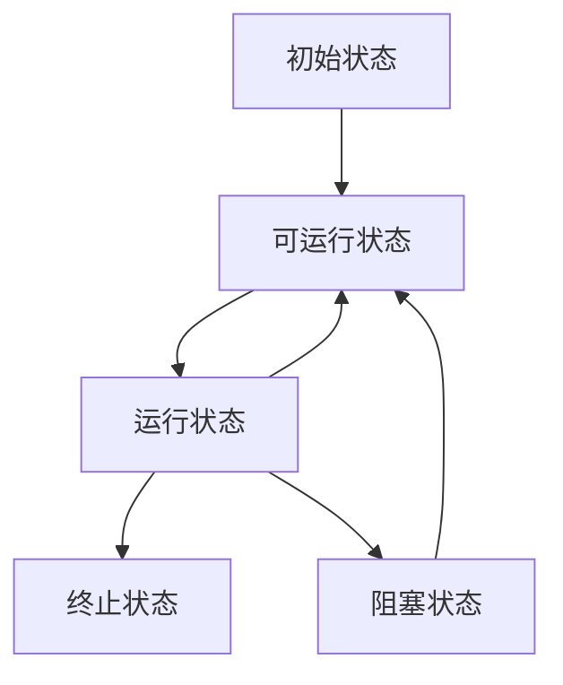

# Java的并发编程：线程的相关概念
- 视频教程：[BiliBili-黑马程序员全面深入学习Java并发编程，JUC并发编程全套教程](https://www.bilibili.com/video/BV16J411h7Rd)
- 笔记（Markdown）：[Gitee](https://gitee.com/gu_chun_bo/java-construct/blob/master/java%E5%B9%B6%E5%8F%91%E7%BC%96%E7%A8%8B/java%E5%B9%B6%E5%8F%911.md)
### 进程与线程
- 进程：当一个程序被运行，从磁盘加载这个程序的代码至内存，这时就开始了一个进程。进程可视为程序的一个实例。进程间相互独立
- 线程：一个进程可分为一到多个线程。一个线程是一个指令流，将指令流中的一条条指令以一定的顺序交给cpu执行。线程存在于进程中
- 线程为最小调度单位，进程为资源分配的最小单位。

### 并行与并发
- 并发：**单核cpu**下，线程是**串行执行**的，由于cpu在线程间的切换时间很快（时间片很短），人为感觉是同时运行的。**”微观串行，宏观并行”**。我们一般将这种**线程轮流使用cpu**的做法成为并发，concurrent。
- 并行：在**多核cpu**系统下可并行，parallel
通常既有并发，也有并行

### 同步与异步
从方法调用的角度来讲，如果
- 需要等待结果的返回，才能继续运行就是**同步**
- 不需要等待结果的返回，就能继续运行就是**异步**。对于长时间的文件调用，异步调用更好。


## Java线程
### 创建线程
1. 直接使用 new Thread()。
    ```java
    Thread t = new Thread () {
        public void run () {
            // 要执行的任务
        }
    }
    // 启动线程
    t.start();
    ```
2. 使用 Runnable 配合 Thread。
   ```java
    Runnable task1 = new Runnable () {
        public void run () {
            // 要执行的任务
        }
    }
    Thread t = new Thread (task1);
    // 启动线程
    t.start();
    ```
    可以用lambda简化代码，类似函数式编程

- 方法1是将线程和任务放在一起，方法2是把线程和任务分开了
- 用 Runnable 更容易与线程池等高级API结合，更灵活。

## 线程运行原理
### 线程上下文切换（Thread Context Switch）
因为以下一些原因导致cpu不再运行当前线程，转而执行另一个线程的代码：
- 线程的cpu时间片用完
- 垃圾回收
- 有更高优先级的线程需要运行
- 线程自己调用了sleep，yield，wait，join，park，synchrnized，lock 等方法  
当上下文切换发生时，需保存当前线程的状态，并恢复另一个线程的状态。频繁切换会影响性能。
    - sleep（当前线程休眠）: 调用sleep（）会让当前线程从*Running*状态进入*Timed Waiting*阻塞状态，该方法不占用cpu。
    - yield（当前线程让出cpu使用权）: 调用yield（）会让当前线程从*Running*状态进入*Runnable*就绪状态
    - join（同步等待）: 等待调用线程运行结束
    - interrupt（打断）

## 两阶段终止模式（Two Phase Termination）
```java
/*  两阶段终止模式（Two Phase Termination）：在进程T1中终止进程T2
    在终止进程T2之前让T2释放锁和临界资源
    不用stop（） 和 System.exit（）
*/
class TwoPhaseTermination {
    // 监控线程
    privite Thread monitor;

    // 启动监控线程
    public void start() {
        monitor = new Thread (() -> {
            while (true) {
                Thread current = Thread.currentThread();
                if (current.isInterrupted()) {
                    // TODO 释放锁和临界资源
                    System.out.println("释放锁和临界资源");
                    break;
                }
                try {
                    Thread.sleep(1000); // 情况1
                    /*
                        TODO 正常功能的代码块
                    */
                    // 情况2
                } catch (InterruptedException e) {
                    e.printStackTrace();
                    // 若sleep时被打断，会捕获错误e，此时的isInterrupted标记为false，程序会重复执行。所以有以下操作
                    current.interrupt(); // 重新设置isInterrupted打断标记
                }
            }
        });
        monitor.start();
    }

    // 停止监控线程
    public void stop() {
        monitor.interrupt();
    }
}
```

### 主线程和守护线程
守护线程：只要其他**非守护线程运行结束了**，即使守护线程的代码没有执行完，也会强制结束
```java
Thread.setDeamon(true); // 默认false
```
## 线程的状态
### 五种状态（操作系统层面）
1. 初始状态：在**语言层面创建了线程对象**，但未与操作系统线程关联
2. 可运行状态：（就需状态），已与操作系统线程关联，可由cpu调度执行
3. 运行状态：获得cpu时间片，正在执行。
   - 当cpu时间片用完，由【运行状态】转为【可运行状态】，导致线程的上下文切换
4. 阻塞状态：该状态下的线程不会占用cpu，会导致线程的上下文切换
   - 等阻塞操作结束，系统唤醒阻塞状态，切换至【可运行状态】
5. 终止状态

### 六种状态（Java语言 API层面）
1. NEW：线程被创建，还没有调用strat（）方法
2. RUNNABLE：调用了start（）方法后。该状态涵盖了**操作系统层面**的*【可运行状态】、【运行状态】和【阻塞状态】*
3. 三种“java中的阻塞状态”：
   1. BLOCKED：
   2. WAITING：
   3. TIMED_WAITING：
4. TERMINATED：代码运行结束
```java
Thread t1 = new Thread("t1") {
    public void run () {}
};
t1.getState(); // NEW


Thread t2 = new Thread("t2") {
    public void run () {
        while (true){ // 运行中: RUNNABLE

        }
    }
};
t2.getState(); // RUNNABLE


Thread t3 = new Thread("t3") {
    public void run () {
        System.out.println("t3: Termination");
    }
};
t3.start();
t3.getState(); // TERMINATED


Thread t4 = new Thread("t4") {
    public void run () {
        synchronized (example.class) {
            try {
                Thread.sleep(300000); // TIMED_WAITING
            } catch (InterruptedException e) {
                    e.printStackTrace();
                    
            }
        }
    }
};
t4.getState(); // TIMED_WAITING


Thread t5 = new Thread("t5") {
    public void run () {
        try {
                t2.join() // WAITING
            } catch (InterruptedException e) {
                    e.printStackTrace();
                    
            }
    }
};
t5.getState(); // WAITING


Thread t6 = new Thread("t6") {
    public void run () {
    /*
        由于t2对example这个类上锁，所以t6并不能完成该上锁操作
        状态：BLOCKED阻塞状态
    */
        synchronized (example.class) {
            try {
                Thread.sleep(300000); // TIMED_WAITING
            } catch (InterruptedException e) {
                    e.printStackTrace();
                    
            }
        }
    }
};
t6.getState(); // BLOCKED
```
# Java的并发编程：共享模型之管程
我们考虑如下情形：
```java
static int count = 0;
    public static void main(String[] args) throws InterruptedException {
        Thread t1 = new Thread(()->{
            for (int i = 1;i<5000;i++){
                count++;
            }
        });
        Thread t2 =new Thread(()->{
            for (int i = 1;i<5000;i++){
                count--;
            }
        });
        t1.start();
        t2.start();
        t1.join();
        t2.join();
        System.out,println("count的值是",count);
    }
```
所得结果并不为`0`
### 临界区 Critical Section
一段代码块内如果存在对**共享资源**的多线程读写操作，称这段代码块为**临界区**
```java
static int counter = 0; // 共享资源
static void increment ()
// 临界区代码块
{
    counter ++;
}

static void decrement ()
// 临界区代码块
{
    counter --;
}
```
### 竞态条件 Race Condition
多个线程在临界区内执行，由于代码的**执行序列不同**而导致结果无法预测，称之为发生了**竞态条件**，多线程的安全问题  

- 阻塞式的解决办法：synchronized、锁
  - 锁又分为：互斥锁（mutex），自旋锁
- 非阻塞式的解决办法：原子变量

### 线程互斥锁：mutex
互斥锁可以确保一个资源**每次只被一个线程访问**
mutex = semaphore（1）
```java
    lock(); // 上锁
    // 访问临界区
    unlock(); //解锁
```

### Semaphore 信号量
信号量，用来限制能**访问共享资源的线程**上限。（类比于滑动窗口）
```java
public class testSemaphore {
    public static void main(String[] args) {
        // 1. 创建semaphore对象
        Semaphore semaphore = new Semaphore(3); // Semaphore(int,boolean), 其中int为访问共享资源的线程数、bool为是否公平

        // 2. 创建6个线程
        for (int i = 0; i < 6; i++) {
            new Thread (() -> {
                semaphore.acquire(); // 获得许可，semaphore数量减1
                System.out.println("Running...");
                Thread.sleep(1000);
                System.out.println("End...");
                semaphore.release(); // 释放许可，semaphore数量加1
            }).start();
        }
    }
}
/*
    运行结果为：
    Thread 0 : Running...
    Thread 1 : Running...
    Thread 2 : Running...
    (sleep 1s)
    Thread 0 : End...
    Thread 1 : End...
    Thread 2 : End...


    Thread 3 : Running...
    Thread 4 : Running...
    Thread 5 : Running...
    (sleep 1s)
    Thread 3 : End...
    Thread 4 : End...
    Thread 5 : End...
*/
```

## Synchronized解决方案
Synchronized，俗称【对象锁】。它采用互斥的方式让同一时刻至多只有一个线程持有【对象锁】，其他线程再想获得这个【对象锁】时就会阻塞住。这样就能保证拥有锁的线程可以安全的执行临界区内的代码块，不用担心上下文的切换。
`注意：`<br>虽然 java 中互斥和同步都可以采用 synchronized 关键字来完成，但它们还是有区别的：
- 互斥是保证临界区的竞态条件发生，同一时刻只能有一个线程执行临界区的代码
- 同步是由于线程执行的先后，顺序不同但是需要一个线程等待其它线程运行到某个点。
### Synchronized 语法：
```java
synchronized（对象，object）// 线程1获得锁， 那么线程2的状态是(blocked)
{
    临界区
}
```
```java
static int counter = 0;
static final Object lock = new Object();
public static void main(String[] args) throws InterruptedException {
     Thread t1 = new Thread(() -> {
         for (int i = 0; i < 5000; i++) {
             synchronized (lock) { // 加对象锁
             counter++;
        	}
 		}
 	}, "t1");
     Thread t2 = new Thread(() -> {
         for (int i = 0; i < 5000; i++) {
             synchronized (lock) { // 加对象锁
             counter--;
         }
     }
     }, "t2");
     t1.start();
     t2.start();
     t1.join();
     t2.join();
     System.out.println(counter);
}
```
此时的结果才为`0`。

### Synchronized 原理
synchronized实际上利用**对象锁**保证了临界区代码的**原子性**，临界区内的代码在外界看来是**不可分割**的，不会被线程切换所打断。
**建议锁的对象设置为`final`，这样就不可变了。**

### Synchronized 面向对象的改进
```java
lockObject lock = new lockObject();
public static void main(String[] args) throws InterruptedException {
     Thread t1 = new Thread(() -> {
         for (int i = 0; i < 5000; i++) {
            lock.increment();
        	}
 		}
 	}, "t1");
     Thread t2 = new Thread(() -> {
         for (int i = 0; i < 5000; i++) {
            lock.decrement();
         }
     }, "t2");
     t1.start();
     t2.start();
     t1.join();
     t2.join();
     System.out.println(counter);
}

class lockObject {
    private int counter = 0;
    //加操作
    public void increment() {
        synchronized (this) {
            counter++;
        }
    }
    //减操作
    public void decrement() {
        synchronized (this) {
            counter--;
        }
    }
    // 获取当前counter
    public int getCounter() {
        synchronized (this) {
            return counter;
        }
    }
}
```
### Synchronized 在方法上
```java
// 在成员方法上
class Test{
        public synchronized void test() {

        }
    }
//等价于
class Test{
    public void test() {
        synchronized(this) { // 锁住this对象
        }
    }
}
```
```java
// 在静态方法上
class Test{
        public synchronized static void test() {

        }
    }
//等价于
class Test{
    public static void test() {
        synchronized(Test.class) {
        }
    }
}
```
## 变量的线程安全分析
### 成员变量和静态变量的线程安全分析
- 如果没有变量没有在线程间共享，那么变量是安全的
- 如果变量在线程间共享
  - 如果只有读操作，则线程安全
  - 如果有读写操作，则这段代码是临界区，需要考虑线程安全
  
### 局部变量线程安全分析
- 局部变量【局部变量被初始化为基本数据类型】是安全的
- 局部变量引用的对象未必是安全的
  - 如果局部变量引用的对象没有引用线程共享的对象，那么是线程安全的
  - 如果局部变量引用的对象引用了一个线程共享的对象，那么要考虑线程安全的
  
### 常见线程安全类
- String
- Integer
- StringBuffer
- Random
- Vector
- Hashtable
- java.util.concurrent 包下的类
这里说它们是线程安全的是指，多个线程调用它们同一个实例的某个方法时，是线程安全的。也可以理解为它们的每个方法是原子的
```java
Hashtable table = new Hashtable();
new Thread(()->{
 	table.put("key", "value1"); 
}).start();
new Thread(()->{
 	table.put("key", "value2");
}).start();
```
### 习题
找出临界区代码，加锁
- 买票：BiliBili-黑马程序员全面深入学习Java并发编程，JUC并发编程全套教程 [买票问题](https://www.bilibili.com/video/BV16J411h7Rd?p=71)
- 转账：BiliBili-黑马程序员全面深入学习Java并发编程，JUC并发编程全套教程 [转账问题](https://www.bilibili.com/video/BV16J411h7Rd?p=74)

## Monitor 概念

## Wait/Notify
### API介绍
- `obj.wait()` 让进入obj监视器的线程到waitSet**等待**
- `obj.wait(long timeout)` 让进入obj监视器的线程到waitSet**等待 timeout时间长度**，继续执行
- `obj.notify()` 在obj上正在waitSet等待的线程中**随机选一个唤醒**
- `obj.notifyAll()` 让obj上正在waitSet等待的线程**全部唤醒** <br>
前提是：**必须获得此对象的锁**，才能调用这几个方法
```java
static final Object lock = new Object ();
public static void main(){

    new Thread (() -> {
        synchronized (lock) {
            try {
                lock.wait(); // 让线程t1在lock上一直等待下去
            } catch (InterruptedException e) {
                e.printStackTrace();
            }
        }
    },"t1").start();

    new Thread (() -> {
        synchronized (lock) {
            try {
                lock.wait(); // 让线程t2在lock上一直等待下去
            } catch (InterruptedException e) {
                e.printStackTrace();
            }
        }
    },"t2").start();

    Thread.sleep(2000);
    synchronized (lock) { // 主线程
        lock.notify(); // 随机唤醒一个
        lock.notifyAll(); // 唤醒所有
    }
}
```
### wait和sleep的区别
- sleep是Thread方法，wait是所有对象的方法
- sleep不用与synchronized一起用，wait需要与synchronized一起用
- sleep**不会释放锁**，wait在等待时**会释放锁**
相同点：进入的状态都是TIMED-WAITING
```java
synchronized (lock){
   while (条件不成立) {
       lock.wait();
    } 
    // TODO
}

// 另一个线程
synchronized (lock){
    lock.notify();
}
```
例子：
```java
import lombok.extern.slf4j.Slf4j;

import static cn.itcast.n2.util.Sleeper.sleep;

@Slf4j(topic = "c.TestCorrectPosture")
public class TestCorrectPostureStep4 {
    static final Object room = new Object();
    static boolean hasCigarette = false;
    static boolean hasTakeout = false;

    public static void main(String[] args) {


        new Thread(() -> {
            synchronized (room) {
                log.debug("有烟没？[{}]", hasCigarette);
                while (!hasCigarette) {
                    log.debug("没烟，先歇会！");
                    try {
                        room.wait();
                    } catch (InterruptedException e) {
                        e.printStackTrace();
                    }
                }
                log.debug("有烟没？[{}]", hasCigarette);
                if (hasCigarette) {
                    log.debug("可以开始干活了");
                } else {
                    log.debug("没干成活...");
                }
            }
        }, "小南").start();

        new Thread(() -> {
            synchronized (room) {
                Thread thread = Thread.currentThread();
                log.debug("外卖送到没？[{}]", hasTakeout);
                if (!hasTakeout) {
                    log.debug("没外卖，先歇会！");
                    try {
                        room.wait();
                    } catch (InterruptedException e) {
                        e.printStackTrace();
                    }
                }
                log.debug("外卖送到没？[{}]", hasTakeout);
                if (hasTakeout) {
                    log.debug("可以开始干活了");
                } else {
                    log.debug("没干成活...");
                }
            }
        }, "小女").start();

        sleep(1);
        new Thread(() -> {
            synchronized (room) {
                hasTakeout = true;
                log.debug("外卖到了噢！");
                room.notifyAll();
            }
        }, "送外卖的").start();
    }
}
```


# Java的并发工具：线程池 Thread Pool
### 自定义线程池
创建一批线程，让这些线程可以得到重复的利用。这样既可以减少内存的占用，也可以减少线程的数量，避免频繁的上下文切换。
```java
public class TestPool {

}
class BlockingQueue<T> {
    // 1.任务队列
    private Deque<T> queue = new ArrayDeque<>();
    // 2.锁
    private ReentrantLock lock = new ReentrantLock();
    // 3.生产者条件变量
    private Condition fullWaitSet = lock.newCondition();
    // 4.消费者条件变量
    private Condition emptyWaitSet = lock.newCondition();
    // 5.容量
    private int capcity;

    // 6.阻塞获取
    public T take() {
        lock.lock();
        try {
            while (queue.isEmpty()) {
                try emptyWaitSet.await();
            } catch (InterruptedException e) {
                e.printStackTrace();
            }
            T t = queue.removeFrist();
        } finally {
            lock.unlock();
        }
    }
    // 7.阻塞添加
    public void put (T element) {

    }
    // 8.获取大小
    public int size() {

    }
}
```

